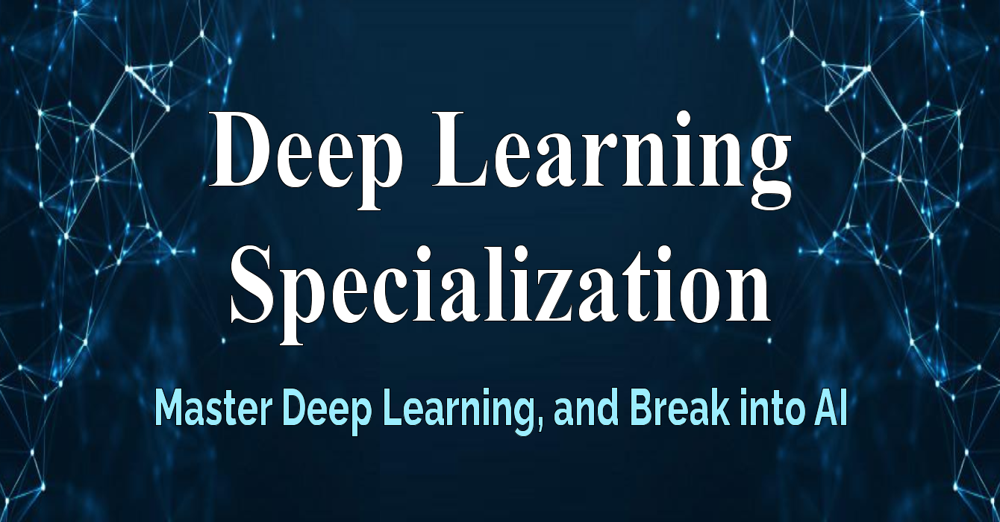

# Grupo de Estudios: Deep Learning Specialization

   

Grupo de Estudios enfocado en los cursos de la especialización de [Deep Learning](https://www.coursera.org/specializations/deep-learning) ofrecidos por coursera.

## ¿Cuál es la dinámica del grupo de estudio?

Nos reunimos semanalmente abarcando temas específicos, revisando el material disponible en el curso con anticipación. El día de la reunión, uno de los integrantes hará una presentación del tema correspondiente y se resolverán las dudas que hayan al respecto. Los demás integrantes pueden aportar con temas adicionales, entablar discusión y voluntariarse para la presentación en futuras reuniones. Algunas semanas serán basadas en presentaciones teóricas y otras en prácticas, dependiendo de las tareas o ejercicios del curso.

## Curso 1: Neural Networks and Deep Learning

   

En este curso aprenderemos los fundamentos de deep learning. Podremos construir, entrenar y aplicar redes neuronales profundas completamente conectadas. Aprenderemos cómo implementar redes neuronales eficientes (vectorizadas). Comprenderemos los parámetros clave en un arquitectura de red neuronal. Este curso también nos enseña cómo funciona realmente el aprendizaje profundo, en lugar de presentar solo una descripción superficial.

### Week 1: Introduction to Deep Learning

Tema  | Slides | Video
-----| :-: | :-: |
Charla Informativa |  | 
Introduction to Deep Learning |  | 

### Week 2: Neural Networks Basics

Tema  | Slides | Video
-----| :-: | :-: |
Neural Networks Basics |  | 
Numpy Tutorial | | 

Practice  | Notebook |
------|:-:|
Python Basics with numpy (optional) |  

Assignment  | Notebook |
------|:-:|
Logistic Regression with a Neural Network mindset | 

### Week 3: Shallow Neural Networks

Tema  | Slides | Video
-----| :-: | :-: |
Shallow Neural Networks |  | 

Assignment  | Notebook |
------|:-:|
Planar data classification with a hidden layer | 

### Week 4: Deep Neural Networks

Tema  | Video
-----| :-: |
Deep Neural Networks |  
AI Research |  

Assignment  | Notebook |
------|:-:|
Building your Deep Neural Network: Step by Step | 
Deep Neural Network Application | 

## Curso 2: Improving Deep Neural Networks

   

En este curso aprenderemos las mejores prácticas de la industria para crear aplicaciones de deep learning. Utilizaremos eficazmente los "trucos" más comunes de la red neuronal, incluyendo la inicialización de parámetros, regularización L2 y dropout, batch normalization, gradient checking. Seremos capaces de implementar y aplicar una variedad de algoritmos de optimización, como mini-batch gradient descent, Momentum, RMSprop y Adam. Aprenderemos los frameworks Tensorflow y Pytorch para la creación de redes neuronales.

### Week 1: Practical aspects of Deep Learning

Tema  | Slides | Video
-----| :-: | :-: |
Practical aspects of Deep Learning |  | 

Assignment  | Notebook |
------|:-:|
Initialization | 
Regularization | 
Gradient Checking | 

### Week 2: Optimization algorithms

Tema  | Slides | Video | Code
-----| :-: | :-: | :-: |
Optimization Algorithms |  |  | 

Assignment  | Notebook |
------|:-:|
Optimization | 

### Week 3: Hyperparameter tuning, Batch Normalization and Programming Frameworks

Tema  | Slides | Video
-----| :-: | :-: |
Hyperparameter tuning, Batch Normalization and Multiclass Classification |  | 

Assignment  | Notebook |
------|:-:|
Tensorflow | 

## Curso 3: Structuring Machine Learning Projects

   

En este curso aprenderemos a crear un proyecto de machine learning exitoso. Comprenderemos cómo diagnosticar errores y ser capaces de priorizar las direcciones más prometedoras para reducirlos. Entenderemos configuraciones complejas de ML, como conjuntos de prueba/entrenamiento con diferente distribución, y comparar y/o superar el rendimiento a nivel humano. Finalmente veremos cómo aplicar el aprendizaje end-to-end, el aprendizaje por transferencia (transfer learning) y el aprendizaje multitarea (multi-task learning).

### Week 1: ML Strategy (1)

Tema  | Slides | Video
-----| :-: | :-: |
Machine Learning Project Strategy |  | 

### Week 2: ML Strategy (2)

Tema  | Slides | Video
-----| :-: | :-: |
Machine Learning Project Strategy (Part 2)|  | 

____
Únete a nuestra comunidad: 
- Facebook: https://www.facebook.com/MLDLMeetupAQP/
- Slack: https://bit.ly/2uoRQKS
